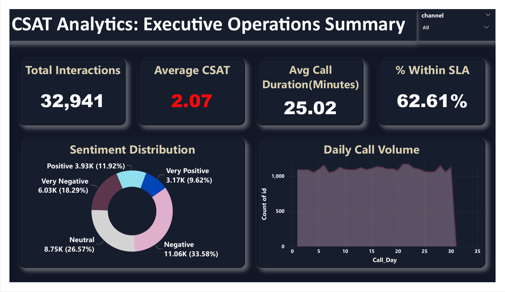

# CSAT Analytics Dashboard

A complete customer satisfaction analysis covering 32,941 support interactions —
from raw data cleaning to an interactive 4-page Power BI dashboard, built to
surface satisfaction drivers, SLA performance, and a significant data quality
issue hiding in the raw survey scores.

## The Problem
The support organization needed visibility into what drives customer satisfaction
across channels, contact reasons, and SLA performance — but the raw CSAT export
had inconsistent date formats and, more critically, a majority of CSAT scores
silently defaulted to zero instead of being left blank, which would have wrecked
every average-score calculation if used as-is.

## The Data
- 32,941 customer support interactions, October 2020
- Source: company CSAT survey export (raw Excel)
- Found and fixed: 20,670 records (62.75%) with invalid zero-coded missing scores

## Tools Used
- **Excel**: data cleaning, date standardization, missing-value isolation, pivot
validation
- **MySQL**: data querying via 10 clean, purpose-built SQL queries
- **Power BI**: 4-page interactive dashboard

## Key Findings
1. 62.75% of CSAT scores were missing/unrecorded (defaulted to 0), a systemic logging issue most severe in the Call-Center channel  
​2. 51.87% of interactions carry Negative or Very Negative sentiment, indicating widespread customer friction  
​3. SLA adherence does not heavily correlate with satisfaction, showing a flat performance spread across categories (Above SLA: 5.62 avg vs Below SLA: 5.56 avg)  
​4. Email is the lowest-scoring communication channel (5.48 avg), while the Call-Center achieves the highest satisfaction (5.61 avg)  
​5. Service Outage interactions drive the lowest satisfaction levels (5.52 avg), while Payments represent the highest resolution satisfaction (5.63 avg)

## Dashboard Pages
- **Executive Overview** — company-wide KPIs and sentiment split at a glance
- **Channel & Contact Reason Performance** — where satisfaction is strongest/weakest operationally
- **SLA & Call Center Performance** — service-level accountability by location
- **Data Quality & Sentiment Deep-Dive** — the missing-score issue, broken down and explained

## Recommendations
​1. Fix the Data Capture Gap: Implement mandatory CSAT logging mechanisms immediately, prioritizing the Call-Center channel to stop missing surveys from automatically defaulting to zero and skewing aggregate metrics
​2. Conduct Root-Cause Friction Analysis: Investigate operational pain points driving the 51.87% negative customer sentiment, shifting the focus from speed metrics to the actual quality of the resolutions provided
​3. Overhaul Email Channel Support: Revamp training, templates, and resolution workflows for the email team, as it currently ranks as the lowest-performing customer communication channel
​4. Target Service Outage Workflows: Build dedicated, high-priority routing and specialized crisis scripts for Service Outage complaints to elevate satisfaction in this specific friction area

## How to Reproduce
1. Clean raw data using steps documented in `/excel/`
2. Import cleaned CSV into MySQL using `/sql/csat_analytics_queries.sql`
3. Open `/powerbi/CSAT_Dashboard.pbix` in Power BI Desktop

## Author
Shridevi Kulkarni -  -[LinkedIn](https://www.linkedin.com/in/shridevi-kulkarni-data-analyst) - shrikulkarni142001@gmail.com 
